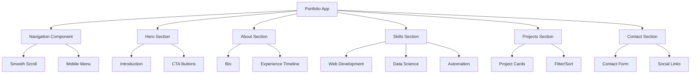

# Python Developer Portfolio Website - Implementation Plan

## Project Overview

Create a modern, responsive single-page portfolio website for a Python software developer showcasing expertise in web development, data science, and automation.

## Technology Stack

- **Frontend Framework**: React with Vite (fast build, modern tooling)
- **Styling**: Tailwind CSS (utility-first, responsive design)
- **Icons**: Lucide React or Heroicons
- **Animations**: Framer Motion (optional, for smooth transitions)
- **Deployment**: Vercel, Netlify, or GitHub Pages

## Architecture Overview



## File Structure

```
portfolio-website/
├── public/
│   ├── favicon.ico
│   └── assets/
│       └── images/
├── src/
│   ├── components/
│   │   ├── layout/
│   │   │   ├── Navbar.tsx
│   │   │   └── Footer.tsx
│   │   ├── sections/
│   │   │   ├── Hero.tsx
│   │   │   ├── About.tsx
│   │   │   ├── Skills.tsx
│   │   │   ├── Projects.tsx
│   │   │   └── Contact.tsx
│   │   ├── ui/
│   │   │   ├── Button.tsx
│   │   │   ├── Card.tsx
│   │   │   ├── Section.tsx
│   │   │   ├── Badge.tsx
│   │   │   └── SocialLink.tsx
│   │   └── common/
│   │       └── ScrollToTop.tsx
│   ├── data/
│   │   ├── portfolio.ts
│   │   └── skills.ts
│   ├── hooks/
│   │   └── useScrollSpy.ts
│   ├── styles/
│   │   └── index.css
│   ├── App.tsx
│   ├── main.tsx
│   └── vite-env.d.ts
├── index.html
├── package.json
├── tailwind.config.js
├── tsconfig.json
└── vite.config.ts
```

## Component Specifications

### 1. Navigation Component (`Navbar.tsx`)

**Features:**

- Fixed header with backdrop blur
- Logo/name on left
- Navigation links on right (desktop)
- Hamburger menu for mobile
- Active section highlighting
- Smooth scroll to sections
- Dark/light mode toggle (optional)

**Props:** None (uses internal state)

### 2. Hero Section (`Hero.tsx`)

**Features:**

- Large heading with name and title
- Subtitle/role description
- Call-to-action buttons (View Projects, Contact)
- Animated background or gradient
- Profile image or illustration (optional)
- Social media quick links

**Data Structure:**

```typescript
{
  name: string;
  title: string;
  subtitle: string;
  description: string;
  ctaButtons: {
    primary: { text: string; link: string };
    secondary: { text: string; link: string };
  };
  socialLinks: Array<{ platform: string; url: string; icon: any }>;
}
```

### 3. About Section (`About.tsx`)

**Features:**

- Professional bio
- Experience timeline
- Education background
- Personal interests (optional)
- Download resume button

**Data Structure:**

```typescript
{
  bio: string[];
  experience: Array<{
    role: string;
    company: string;
    period: string;
    description: string[];
  }>;
  education: Array<{
    degree: string;
    institution: string;
    year: string;
  }>;
}
```

### 4. Skills Section (`Skills.tsx`)

**Features:**

- Categorized skills (Web, Data, Automation)
- Skill cards with icons
- Proficiency indicators (optional)
- Filter by category
- Hover effects

**Data Structure:**

```typescript
{
  categories: {
    web: {
      name: string;
      icon: any;
      skills: Array<{
        name: string;
        level: number; // 1-5
        icon?: any;
      }>;
    };
    data: { ... };
    automation: { ... };
  };
}
```

### 5. Projects Section (`Projects.tsx`)

**Features:**

- Grid of project cards
- Project details modal or expand
- Filter by technology/category
- Links to live demo and GitHub
- Project thumbnails/screenshots
- Tech stack badges

**Data Structure:**

```typescript
{
  projects: Array<{
    id: string;
    title: string;
    description: string;
    image?: string;
    technologies: string[];
    category: 'web' | 'data' | 'automation';
    liveUrl?: string;
    githubUrl?: string;
    featured: boolean;
  }>;
}
```

### 6. Contact Section (`Contact.tsx`)

**Features:**

- Contact form (name, email, message)
- Form validation
- Email integration (Formspree, EmailJS, or backend)
- Social media links
- Location/contact info
- Success/error feedback

**Form Fields:**

- Name (required)
- Email (required, validated)
- Subject (optional)
- Message (required)

### 7. UI Components

#### Button (`Button.tsx`)

- Variants: primary, secondary, outline, ghost
- Sizes: sm, md, lg
- With/without icon
- Loading state
- Disabled state

#### Card (`Card.tsx`)

- Container for project/skill cards
- Hover effects
- Responsive grid layout
- Image support

#### Section (`Section.tsx`)

- Consistent section wrapper
- Section title and subtitle
- Optional background color
- Padding/margin consistency

#### Badge (`Badge.tsx`)

- Small tags for technologies
- Color variants
- Pill shape

#### SocialLink (`SocialLink.tsx`)

- Social media icon links
- Hover effects
- Consistent sizing

## Data Management

### Portfolio Data (`src/data/portfolio.ts`)

Centralized configuration for all portfolio content:

```typescript
export const portfolioData = {
  hero: { ... },
  about: { ... },
  skills: { ... },
  projects: { ... },
  contact: { ... },
  social: { ... }
};
```

### Skills Data (`src/data/skills.ts`)

Detailed skill categorization:

```typescript
export const skillsData = {
  web: [
    { name: 'Django', level: 4, icon: 'django' },
    { name: 'Flask', level: 4, icon: 'flask' },
    { name: 'FastAPI', level: 3, icon: 'fastapi' },
    { name: 'REST APIs', level: 5, icon: 'api' },
    { name: 'PostgreSQL', level: 4, icon: 'postgres' },
    { name: 'SQLAlchemy', level: 4, icon: 'sqlalchemy' },
  ],
  data: [
    { name: 'Pandas', level: 5, icon: 'pandas' },
    { name: 'NumPy', level: 4, icon: 'numpy' },
    { name: 'Scikit-learn', level: 4, icon: 'sklearn' },
    { name: 'Matplotlib', level: 4, icon: 'matplotlib' },
    { name: 'Jupyter', level: 5, icon: 'jupyter' },
  ],
  automation: [
    { name: 'Selenium', level: 4, icon: 'selenium' },
    { name: 'BeautifulSoup', level: 5, icon: 'bs4' },
    { name: 'Requests', level: 5, icon: 'requests' },
    { name: 'Celery', level: 3, icon: 'celery' },
    { name: 'Docker', level: 3, icon: 'docker' },
  ]
};
```

## Styling Guidelines

### Color Palette (Tailwind)

- Primary: `blue-600` (professional, trustworthy)
- Secondary: `indigo-600` (modern, creative)
- Accent: `emerald-500` (success, growth)
- Background: `gray-50` to `white`
- Text: `gray-900` (headings), `gray-600` (body)
- Dark mode support (optional)

### Typography

- Headings: `font-bold` with tight tracking
- Body: `font-normal` with relaxed line-height
- Code: `font-mono` for technical terms

### Spacing

- Section padding: `py-20` (desktop), `py-12` (mobile)
- Container max-width: `max-w-7xl`
- Gap between elements: `gap-6` to `gap-8`

### Responsive Breakpoints

- Mobile: `< 768px` (sm)
- Tablet: `768px - 1024px` (md)
- Desktop: `> 1024px` (lg, xl)

## Animation Strategy

### Using Framer Motion (Optional)

- Fade-in on scroll for sections
- Stagger animation for cards
- Hover effects on interactive elements
- Smooth page transitions

### CSS Transitions (Fallback)

- `transition-all duration-300`
- `hover:scale-105` for cards
- `hover:text-primary` for links
- `focus:ring` for accessibility

## Implementation Steps

### Phase 1: Project Setup

1. Initialize Vite + React + TypeScript project
2. Install Tailwind CSS and configure
3. Install dependencies (lucide-react, framer-motion)
4. Set up folder structure
5. Configure TypeScript

### Phase 2: Core Components

1. Create base UI components (Button, Card, Section, Badge)
2. Create layout components (Navbar, Footer)
3. Create ScrollToTop component
4. Set up global styles

### Phase 3: Sections Development

1. Build Hero section with animations
2. Build About section with timeline
3. Build Skills section with categories
4. Build Projects section with cards
5. Build Contact section with form

### Phase 4: Data Integration

1. Create portfolio data structure
2. Create skills data structure
3. Populate with sample content
4. Make data easily editable

### Phase 5: Navigation & UX

1. Implement smooth scrolling
2. Add scroll spy for active nav
3. Implement mobile menu
4. Add loading states
5. Add error handling

### Phase 6: Responsive Design

1. Test on mobile devices
2. Test on tablet devices
3. Test on desktop
4. Adjust breakpoints as needed
5. Optimize images

### Phase 7: Polish & Animations

1. Add scroll animations
2. Add hover effects
3. Add micro-interactions
4. Optimize performance
5. Test accessibility

### Phase 8: Testing & Deployment

1. Test all functionality
2. Test form submission
3. Test all links
4. Deploy to hosting platform
5. Verify production build

## Contact Form Integration Options

### Option 1: Formspree (Easiest)

- Free tier available
- No backend needed
- Simple HTML form

### Option 2: EmailJS

- Free tier available
- Client-side only
- Custom email templates

### Option 3: Backend Service

- Python Flask/FastAPI backend
- Full control over emails
- More complex setup

## Performance Optimization

- Lazy load images
- Code splitting with React.lazy
- Minimize bundle size
- Use WebP images
- Implement caching
- Optimize animations

## Accessibility Considerations

- Semantic HTML elements
- ARIA labels where needed
- Keyboard navigation support
- Focus indicators
- Color contrast ratios
- Alt text for images
- Screen reader friendly

## SEO Best Practices

- Meta tags (title, description)
- Open Graph tags
- Twitter Card tags
- Structured data (JSON-LD)
- Semantic HTML
- Fast loading times
- Mobile-friendly

## Deployment Options

### Vercel (Recommended)

- Free tier
- Automatic deployments
- Fast CDN
- Easy setup

### Netlify

- Free tier
- Continuous deployment
- Form handling built-in

### GitHub Pages

- Free hosting
- Simple setup
- GitHub integration

## Future Enhancements (Optional)

- Blog section
- Dark/light mode toggle
- Multi-language support
- Testimonials section
- Downloadable resume PDF
- Analytics integration (Google Analytics)
- PWA capabilities
- 3D animations (Three.js)

## Success Criteria

✅ All sections render correctly
✅ Fully responsive on all devices
✅ Smooth scrolling navigation
✅ Contact form works
✅ All links functional
✅ Fast loading (< 3 seconds)
✅ Accessible (WCAG AA)
✅ SEO optimized
✅ Easy to update content
✅ Professional appearance
